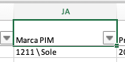
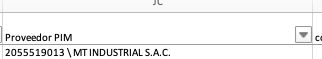

# Marca y Proveesdor
Se debe crear hojas con el catálogo de Marcas y Proveedores de PIM

Se debe concatenar el id con las descrip y colocar en campos como **Marca PIM** y **Proveedor PIM**

Formulas:

- Marca:

=SI(ESPACIOS(BS2)="";"";BUSCARV(BS2;MARCAS!$A:$C;2;0))

- Proveedor:

=CC2 & " \ "&BUSCARV(CC2;'proveedores step'!A:B;2;FALSO)

# Validaciones necesarias

- Fechas en formato 2025/02/01 a 2025-02-01 en Fecha de Inicio
- Medida en pulgadas con formato fracción o No aplica, debe ser numérico
- Atributo Densidad con N/A reemplazar por vacio
- Filtrar los registros que no tengan SKU, estos no deben cargarse

Para procesar los errados:
- Cargar el resultado de LogSkuOK en una hoja llamada OK, agregar una columna **Item NumberOK** en la hoja de la data, y en esta columna hacer buscarv de sku en esta nueva hoja
- Cargar el resultado de LogSkuErr en una hoja llamada Err, agregar una columna **Item NumberErr** en la hoja de la data, y en esta columna hacer buscarv de sku en esta nueva hoja
- Crear la columna Item Number en la hoja de data, y es es columa carga con la función SI, si existe **Item NumberOK**, colocar este dato, en caso contrario buscar **Item NumberERR**

